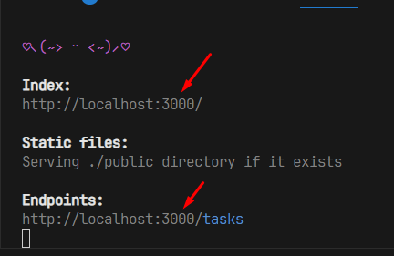
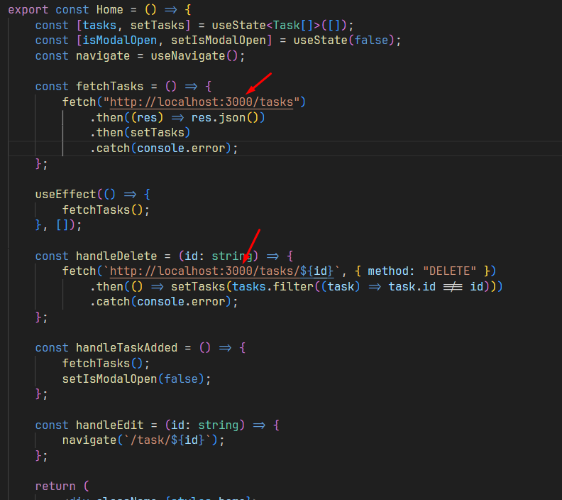

<h1>Описание реализации функционала</h1>

1. Добавление задачи. Реализован через модальное окно, используется stepper из MUI, отправка данных на json-server
2. Редактирование задач. Реализован на отдельной странице. Можно редактировать задачу, описание, теги через форму и полей ввода, реализованных через MUI. Есть кнопка сохранения и отмены.
3. Удаление задачи. Просто удалить задачу.
4. Данные о задачах хранятся в json-server.
5. Переход между страницами по SPA поведению.

<h2>Как запустить</h2>

1. Для начала потребуется любой редактор кода (Н-р, Visual Studio Code)
2. Откройте 2 терминала (2 вкладками или сплитом)
3. Запустите json-server командой: npx json-server db.json
4. Убедитесь, что значения порта в консоли совпадает со значениями порта в коде  иначе приложение **НЕ ЗАПУСТИТСЯ!!!** (нужно проверить порт в каждом файле, где он есть)
5. Переключить на 2 открытый терминал и запустить приложение через команду: npm run dev
6. Открыть ссылку из консоли (нажав ctrl + ЛКМ или скопиров ссылку и вставить в адресную строку)
7. Готово! Можно пользоваться приложением!!

<h2>Используемые технологии и подходы</h2>

>Сборщик: Vite  
React TypeScript + SWC  
Redux Toolkit + react-redux  
React Router V6  
Material UI + Material Icons  
Инструменты: CSS Modules  
Aliases Path

Доп. библиотеки: 
- [date-fns](https://www.npmjs.com/package/date-fns) - Для работы с датами и их форматирование
- [json-server](https://www.npmjs.com/package/json-server) - Простая база данных для хранения данных
- [uuid](https://www.npmjs.com/package/uuid) - Для генерации уникальных ключей
- [react-truncate-markup](https://www.npmjs.com/package/react-truncate-markup) - библиотека для обрезания текста и преобразования его в троеточие
- [ESLint](https://www.npmjs.com/package/eslint) - Форматирование кода (Плагин взят из VSC Plugins)

<h2>Краткое описание применённой архитектуры</h2>
Проект построен по Feature-Sliced Design (FSD) с разделением на:

* app/ — ядро (Redux, глобальные стили)
* features/tasks/ — логика задач (Redux + UI + API)
* pages/ — страницы 
* shared/ — переиспользуемые ресурсы (типы, UI-компоненты, константы)
* widgets/ — сложные UI-блоки
